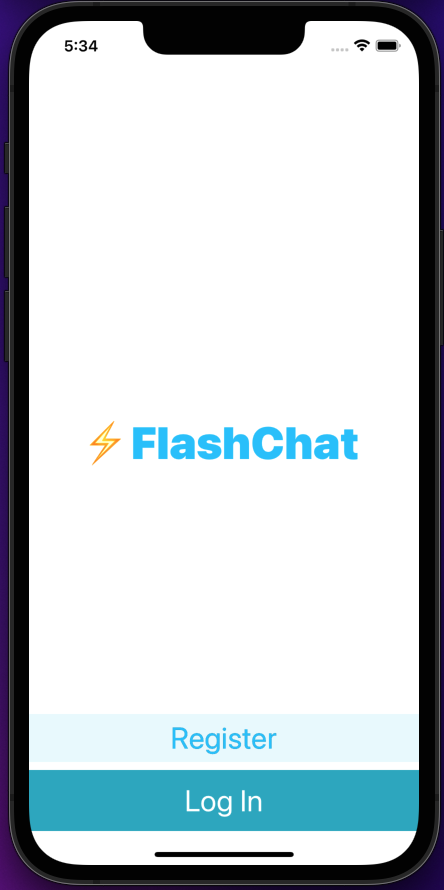
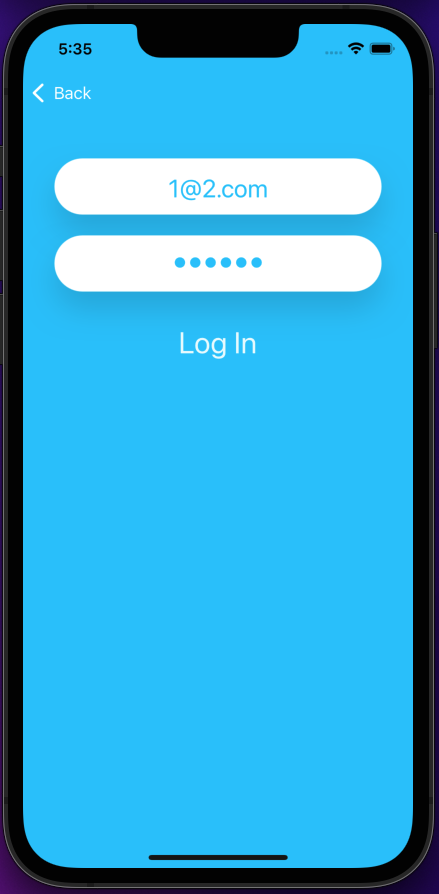
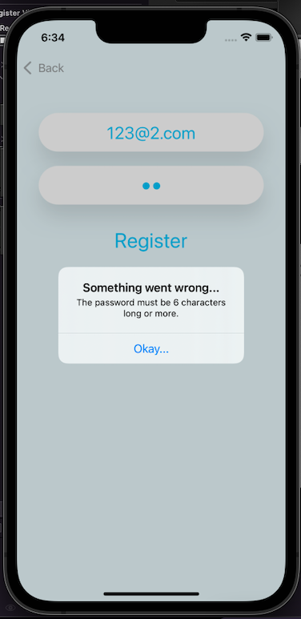
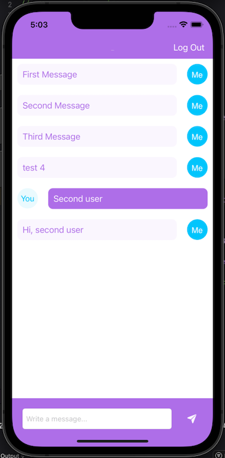

# Flash-Chat

## Our Goal

One of the most fundamental component of modern iOS apps is the Table View. Table Views are used everywhere from the Mail app to the Messages app. It’s a crucial part of every iOS developer’s tool belt. In this tutorial we’ll be getting to grips with Table Views, creating custom cells, and making our own cloud-based backend database. It’s going to be epic, so buckle up.

## What I've created

By the end of this project, I've got a fully functional app similar to Whatsapp. I've used the Firebase service with Firestore as a backend database to store and retrieve the messages in real-time.

## Some in-app screens
 

  
&nbsp; &nbsp; &nbsp; &nbsp;
  
&nbsp; &nbsp; &nbsp; &nbsp;
  
&nbsp; &nbsp; &nbsp; &nbsp;
  

## What I've learned

* How to integrate third party libraries in your app using Cocoapods and Swift Package Manager.
* How to store data in the cloud using Firebase Firestore.
* How to query and sort the Firebase database.
* How to use Firebase for user authentication, registration and login.
* How to work with UITableViews and how to set their data sources and delegates.
* How to create custom views using .xib files to modify native design components.
* How to embed View Controllers in a Navigation Controller and understand the navigation stack.
* How to create a constants file and use static properties to store Strings and other constants.
* Learn about Swift loops and create animations using loops.
* Learn about the App Lifecycle and how to use viewWillAppear or viewWillDisappear.
* How to create direct Segues for navigation.

>This is a companion project to The App Brewery's Complete App Development Bootcamp complete by Luiz Silva.
